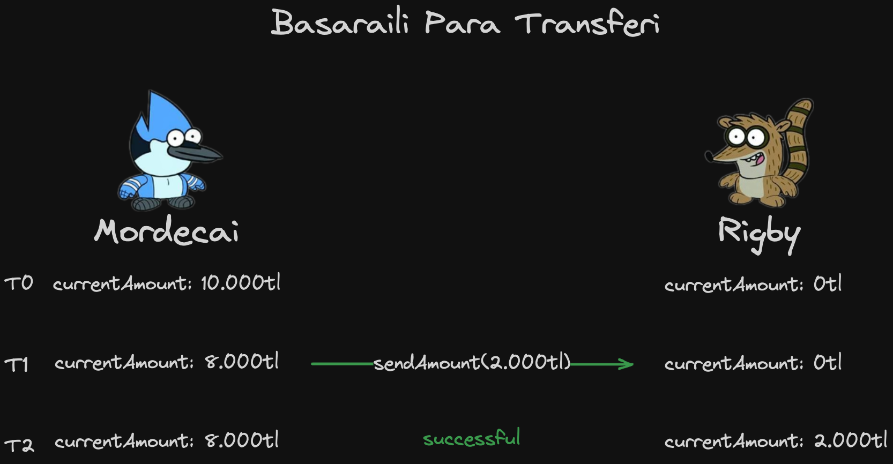
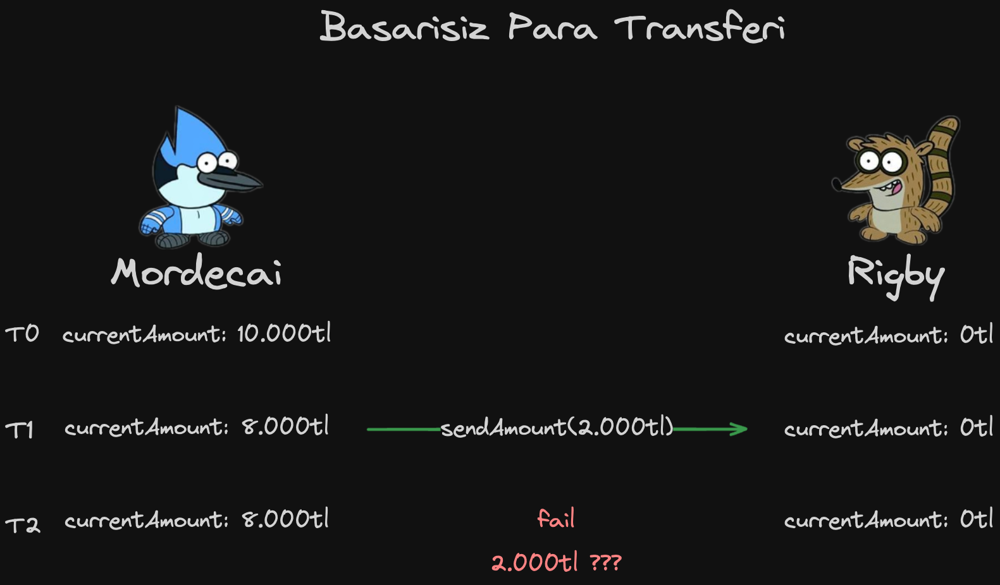
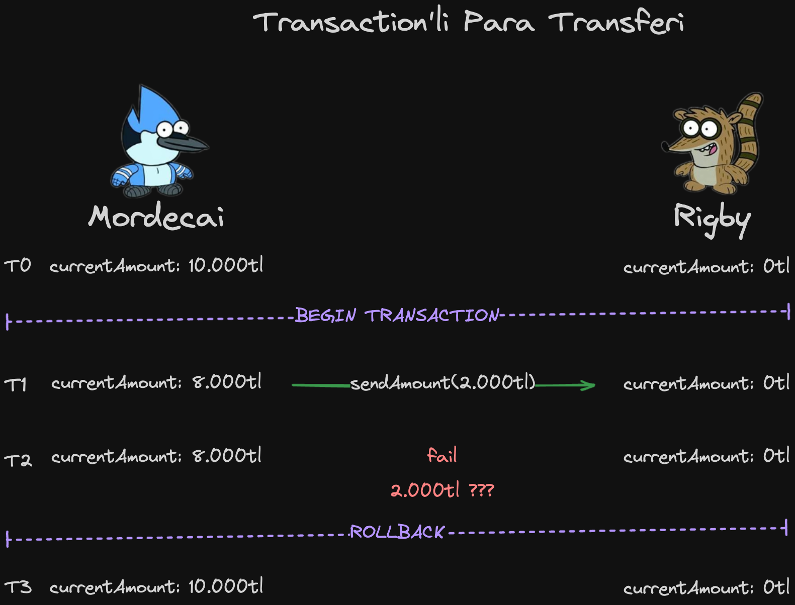
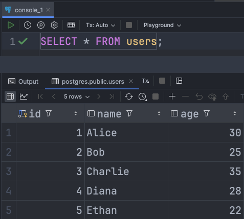
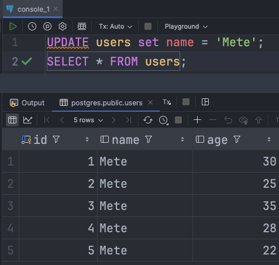
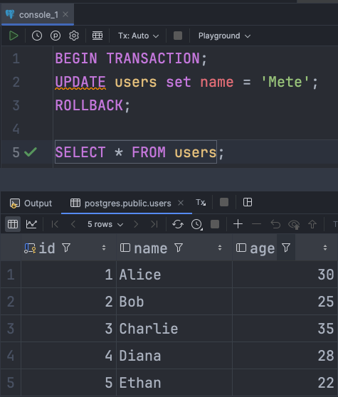
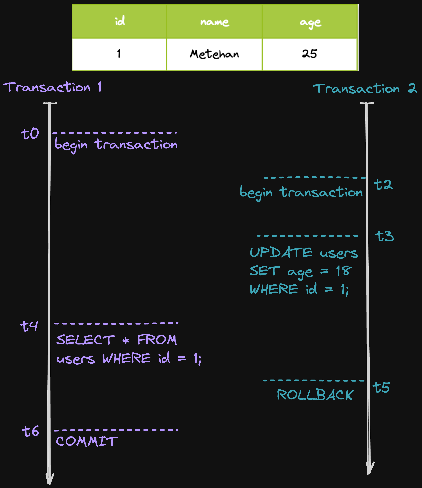
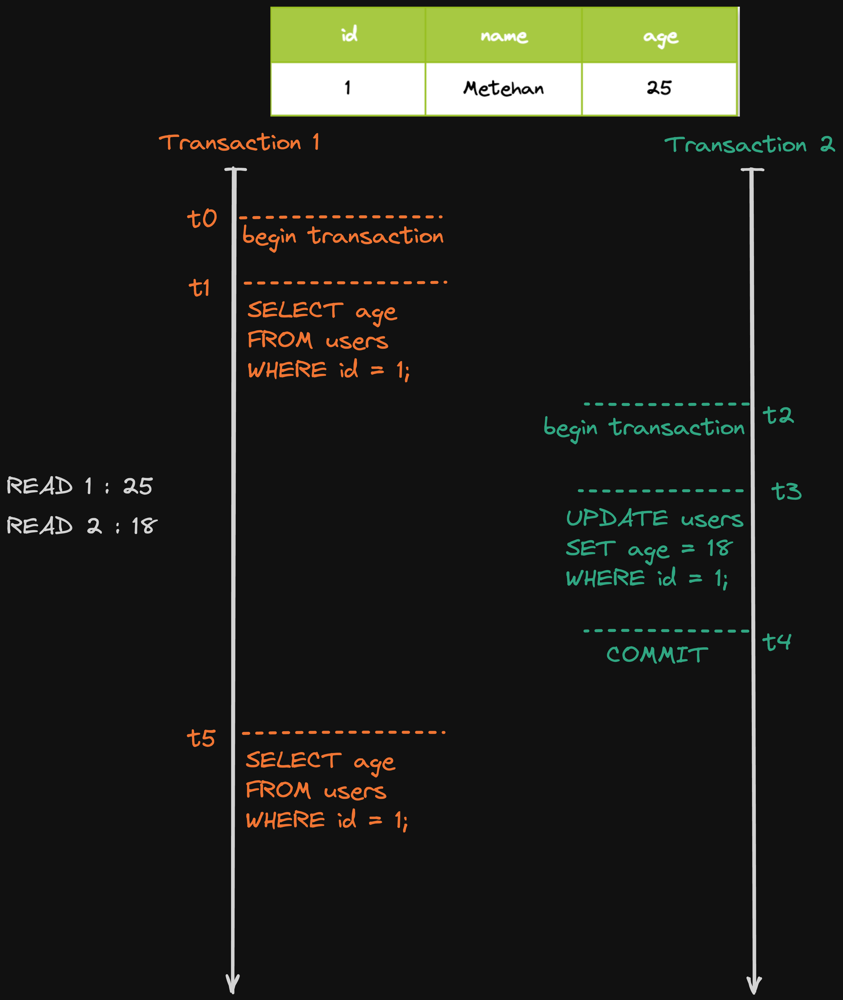
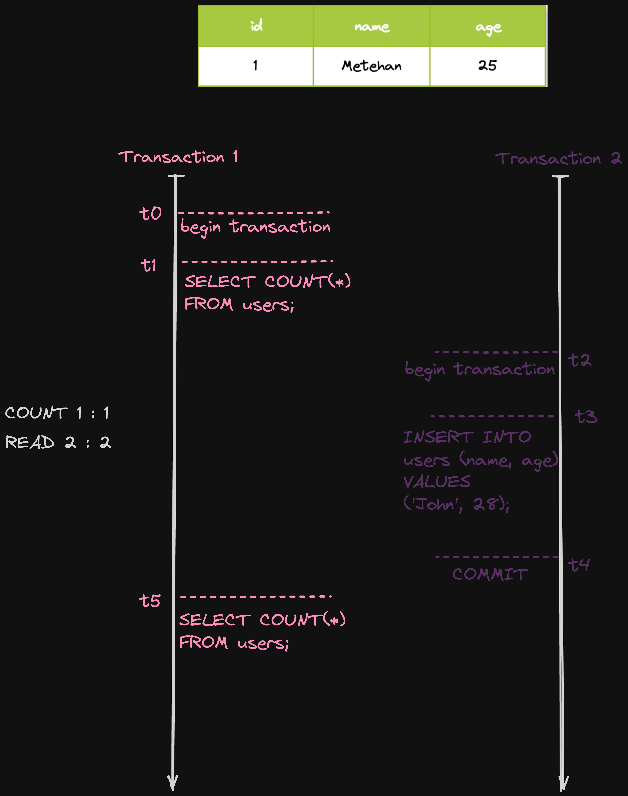
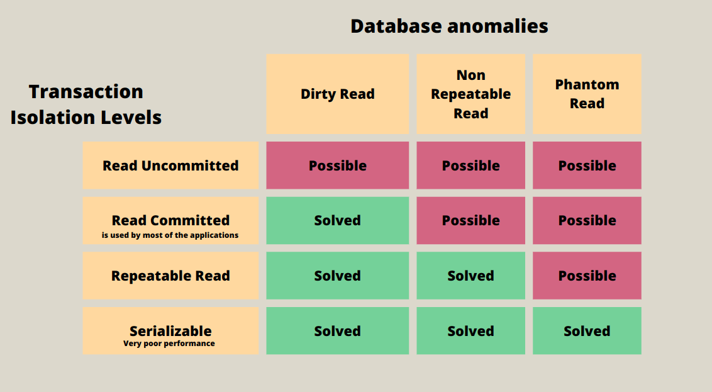

# Spring Boot Transaction
Transaction'lar, veri tutarliligi, hata yonetimi ve sistem guvenilirligi saglamak icin kritik oneme sahiptir. Transaction'lara neden ihtiyac duydugumuzu bir ornekle inceleyelim.

### Good Case:

    

### Worst Case:

    

### Transaction Nedir?
Bir **transaction** (islem), bir veritabani uzerinde bir veya daha fazla sorgunun (CRUD islemleri gibi) bir butun olarak gerceklesmesini saglayan bir islem kumesidir. Transactionlar ya tamamen basarili olur ve **commit** edilir  ya da basarisiz olursa tum islemler **rollback** ile geri alinir. Bu, veritabani uzerinde tutarliligi ve butunlugu saglar. Ornegin, bir bankada para transfer islemi iki ayri adim icerir: bir hesaptan para cekme ve baska bir hesaba para yatirma. Bu iki adimin bir butun olarak basarili olmasi gerekir; biri basarisiz olursa, islemin tamami geri alinir.

    

### Commit Nedir?
**Commit**, bir transaction'in basariyla tamamlandigini ve yapilan tum degisikliklerin kalici olarak veritabanina kaydedildigini ifade eder. Transaction'daki tum islemler basarili oldugunda, commit edilir ve veritabani uzerindeki degisiklikler kalici hale gelir.

### Rollback Nedir?
**Rollback**, bir transaction'in basarisiz oldugu durumlarda, veritabaninda yapilan degisikliklerin geri alinmasidir. Boylece transaction sirasinda yapilan degisiklikler gecersiz hale getirilir ve veritabani onceki haline dondurulur. Rollback, veri tutarliligini korumak icin kullanilir.

### Database Transaction Ornegi

    

    

    

---
## Spring Boot Transaction Ozellikleri

#### 1. **Propagation**
Transaction yonetiminin nasil ele alinacagini belirleyen bir ozelliktir. Transaction'in varligi ve yeni transaction baslatma kosullari, propagation turune bagli olarak degisir:

1. **REQUIRED (Gerekli):**
    - `NotificationService.sendNotification()` dogrudan cagrildiginda, kendi Transaction段ni olusturur.
    - `UserService.registerUser()` metodundan `sendNotification()` cagrildiginda:
        - a. Eger `registerUser()` metodunda bir Transaction varsa, mevcut Transaction kullanilir.
        - b. Eger `registerUser()` metodunda Transaction yoksa, `sendNotification()` kendi Transaction段ni olusturur.
    - Yani, `REQUIRED` durumunda `sendNotification()`, mevcut bir Transaction varsa onu kullanir; yoksa kendi Transaction段ni baslatir.

    

2. **REQUIRES_NEW (Yeni Gerekir):**
    - `NotificationService.sendNotification()` dogrudan cagrildiginda, kendi yeni Transaction段ni olusturur.
    - `UserService.registerUser()` metodundan `sendNotification()` cagrildiginda:
        - a. Eger `registerUser()` metodunda bir Transaction varsa, bu mevcut Transaction kullanilmaz ve `sendNotification()` yeni bir Transaction olusturur.
        - b. Eger `registerUser()` metodunda Transaction yoksa, `sendNotification()` kendi yeni Transaction段ni olusturur.
    - Yani, `REQUIRES_NEW` durumunda `sendNotification()`, her zaman yeni bir Transaction olusturur.

    

3. **SUPPORTS (Desteklenir):**
    - `NotificationService.sendNotification()` dogrudan cagrildiginda, kendi Transaction段ni olusturmaz.
    - `UserService.registerUser()` metodundan `sendNotification()` cagrildiginda:
        - a. Eger `registerUser()` metodunda bir Transaction varsa, mevcut Transaction kullanilir.
        - b. Eger `registerUser()` metodunda Transaction yoksa, `sendNotification()` yeni bir Transaction olusturmaz ve Transaction olmadan calisir.
    - Yani, `SUPPORTS` durumunda, mevcut bir Transaction varsa onu kullanir; yoksa Transaction olmadan calisir.

    

4. **NOT_SUPPORTED (Desteklenmez):**
    - `NotificationService.sendNotification()` dogrudan cagrildiginda, yeni bir Transaction olusturmaz.
    - `UserService.registerUser()` metodundan `sendNotification()` cagrildiginda:
        - a. Eger `registerUser()` metodunda bir Transaction varsa, bu mevcut Transaction kullanilmaz ve `sendNotification()` Transaction olmadan calisir.
        - b. Eger `registerUser()` metodunda Transaction yoksa, `sendNotification()` yine yeni bir Transaction olusturmaz ve Transaction olmadan calisir.
    - Yani, `NOT_SUPPORTED` durumunda `sendNotification()` hicbir zaman Transaction kullanmaz.

    

5. **MANDATORY (Zorunlu):**
    - `NotificationService.sendNotification()` dogrudan cagrildiginda, bir Exception firlatir.
    - `UserService.registerUser()` metodundan `sendNotification()` cagrildiginda:
        - a. Eger `registerUser()` metodunda bir Transaction varsa, mevcut Transaction kullanilir.
        - b. Eger `registerUser()` metodunda Transaction yoksa, `sendNotification()` yeni bir Transaction olusturmaz ve Exception firlatir.
    - Yani, `MANDATORY` durumunda `sendNotification()` her zaman bir Transaction gerektirir; aksi takdirde Exception firlatilir.

    

6. **NEVER (Asla):**
    - `NotificationService.sendNotification()` dogrudan cagrildiginda, yeni bir Transaction olusturmaz.
    - `UserService.registerUser()` metodundan `sendNotification()` cagrildiginda:
        - a. Eger `registerUser()` metodunda bir Transaction varsa, bir Exception firlatilir.
        - b. Eger `registerUser()` metodunda Transaction yoksa, `sendNotification()` islemsiz calisir.
    - Yani, `NEVER` durumunda `sendNotification()` hicbir zaman Transaction kullanmaz ve mevcut bir Transaction varsa Exception firlatir.

    

7. **NESTED (Asla):**
- Mevcut bir Transaction icinde yeni bir alt Transaction baslatilir. Bu alt Transaction, ana Transaction壇an bagimsiz olarak commit veya rollback edilebilir.
    - `NotificationService.sendNotification()` dogrudan cagrildiginda:
        - **Sonuc:** Kendi yeni alt Transaction段ni olusturur.
    - `UserService.registerUser()` metodundan `sendNotification()` cagrildiginda:
        - a. Eger `registerUser()` metodunda bir Transaction varsa:
            - **Sonuc:** `sendNotification()` mevcut Transaction icinde calisir ve yeni bir alt Transaction olusturur.
        - b. Eger `registerUser()` metodunda Transaction yoksa:
            - **Sonuc:** `sendNotification()` kendi yeni alt Transaction段ni olusturur.
    - Yani, `NESTED` durumunda `sendNotification()`, mevcut bir Transaction varsa alt Transaction olusturur; yoksa kendi alt Transaction段ni baslatir.

    

 

!!! Private metotlarda @Transactional anotasyonu calisir mi?

Hayir, **private** metotlarda **@Transactional** anotasyonu **calismaz**. Bunun nedeni, Spring'in **@Transactional** anotasyonunu uygularken **AOP (Aspect-Oriented Programming)** yaklasimini kullanmasidir. Spring, transactional islemleri yonetmek icin metotlari **proxy**'ler, ancak yalnizca **public** metotlar bu proxy mekanizmasina dahil edilebilir.

**@Transactional** anotasyonunu bir **private** metoda uygularsaniz, Spring bu metodu proxy'lemedigi icin transactional yonetimi uygulanmaz. Yani, **private** metotlar transactional islemleri baslatmaz veya yonetmez.

**Transactional islemleri private metotlar icin kullanabilmenin yollari sunlardir:**

1. **Metodu public yapin:** Eger transactional davranisini istiyorsaniz, metodu **public** hale getirmeniz gerekir.

2. **Metodu baska bir public metot uzerinden cagirin:** Eger private metodu degistirmek istemiyorsaniz, onu bir **public** metot icinde cagirabilir ve transactional islemi bu **public** metoda uygulayabilirsiniz.

Bu durumda, transactional islem yalnizca **public** metodun cagrilmasiyla baslar ve **private** metot, transactional islemi yonetemez.

#### 2. **readOnly**
`readOnly = true` olarak ayarlandiginda, Transaction段n yalnizca okuma islemi yapacagini belirtir. Veritabanina yazma islemi yapilmaz. Bu, performansi artirabilir ve bazi veritabani optimizasyonlarini tetikleyebilir.

#### 3. **timeout**
Transaction段n ne kadar sure icinde tamamlanmasi gerektigini belirler. Belirtilen sureyi asan transaction otomatik olarak rollback edilir. Ornegin, `timeout = 5` saniye seklinde belirtildiginde, 5 saniyeden uzun suren islemler geri alinir.

#### 4. **rollbackFor**
Hangi istisnalarin (exceptions) transaction段n rollback edilmesini tetikleyecegini belirler. Ornegin, `rollbackFor = Exception.class` kullanildiginda, belirtilen turde bir istisna meydana geldiginde transaction geri alinir.

### Transaction isolation Anomalileri

#### **DIRTY READS( Kirli Okuma)**
- **Dirty Reads**, bir transaction段n baska bir transaction tarafindan yapilan ancak commit edilmemis degisiklikleri okumasidir. Eger bu degisiklikler daha sonra rollback edilirse, okunan veriler gecersiz hale gelir. Bu durum veri tutarsizliklarina yol acabilir.

    

#### **NON-REPEATABLE READS (Tekrarlanamayan Okuma)**
- **Non-Repeatable Reads**, ayni transaction icinde ayni satirin farkli zamanlarda farkli sonuclarla okunmasidir. Bu, baska bir transaction'in veriyi guncellemesi ve commit etmesi durumunda meydana gelir.

    

#### **PHANTOM READS (Hayalet Okuma)**
- **Phantom Reads**, bir transaction'in ayni sorguyu tekrar ettiginde, daha once mevcut olmayan yeni satirlar eklenir (veya mevcut satirlar silinir). Ayni islem icinde yapilan sonraki bir okuma, ilk okuma sirasinda mevcut olmayan satirlari icerebilir ya da silinen satirlari icermeyebilir.

    

#### 5. **isolation**
Bir transaction段n diger transaction'larla olan etkilesim duzeyini belirler. Transaction isolation seviyeleri, bir transaction'in veritabanindaki diger transaction'larin yaptigi degisiklikleri ne zaman gorebilecegini kontrol eder.

Isolation es zamanli transactionlari, pararelde birbirlerini etkilemeden calistirmamizi saglar.

### Isolation Seviyeleri

- **READ_UNCOMMITTED**: Bir transaction, diger transaction'larin henuz commit edilmemis degisikliklerini gorebilir. Bu seviyede **dirty reads** , **non-repeatable reads** ve **phantom reads** olabilir. Yani, bir transaction baska bir transaction tarafindan yapilmis ancak henuz commit edilmemis bir degisikligi okuyabilir. 
  ! En hizlidir cunku veritabani islemleri uzerinde cok az kisitlama vardir.
- **READ_COMMITTED**: Bir transaction yalnizca diger transaction'lar tarafindan commit edilmis degisiklikleri okuyabilir. **Dirty reads** engellenir.
- **REPEATABLE_READ**: Bir transaction basladiginda ayni satiri birden fazla okudugunda, ayni veriyi gormeyi garanti eder. Ancak **phantom reads** hala olabilir. Yani, transaction sirasinda baska bir transaction yeni satirlar ekleyebilir.
- **SERIALIZABLE**: En yuksek seviye izolasyondur. Tum transaction'lar sirali olarak gerceklestirilir. **Dirty reads**, **non-repeatable reads**, ve **phantom reads** gibi durumlar tamamen engellenir. Ancak, performans maliyeti yuksektir.

    

